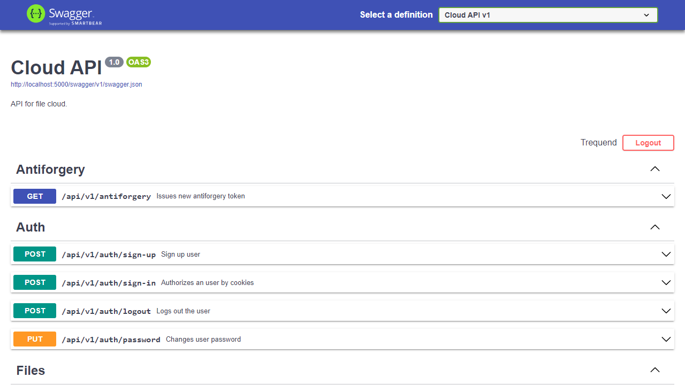
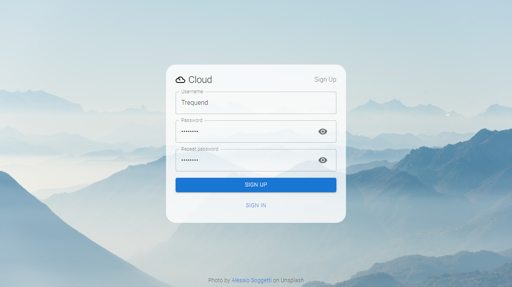
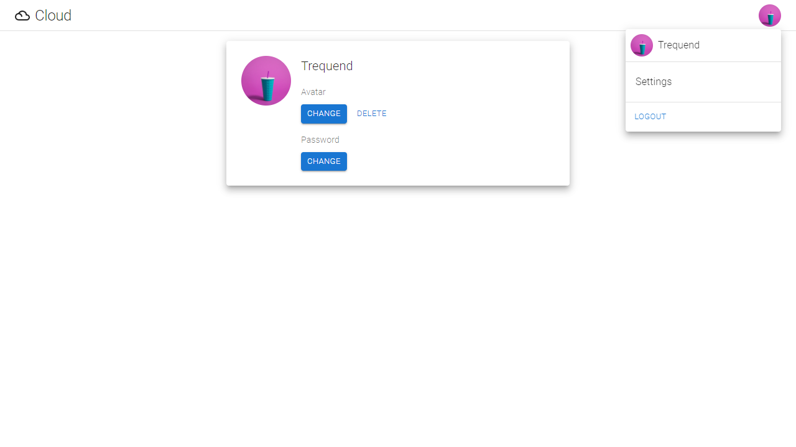
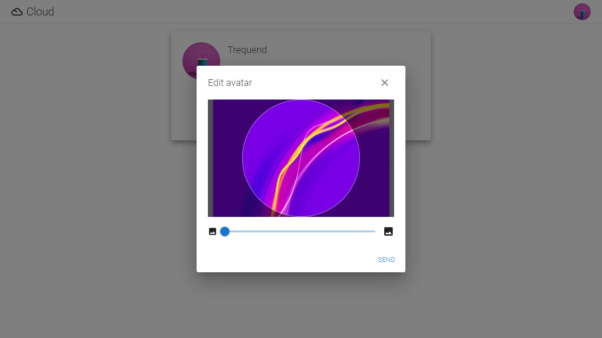
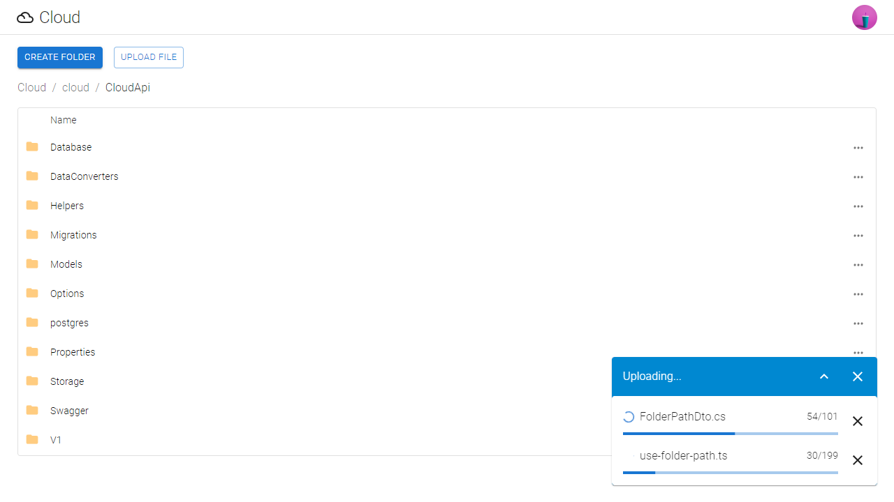
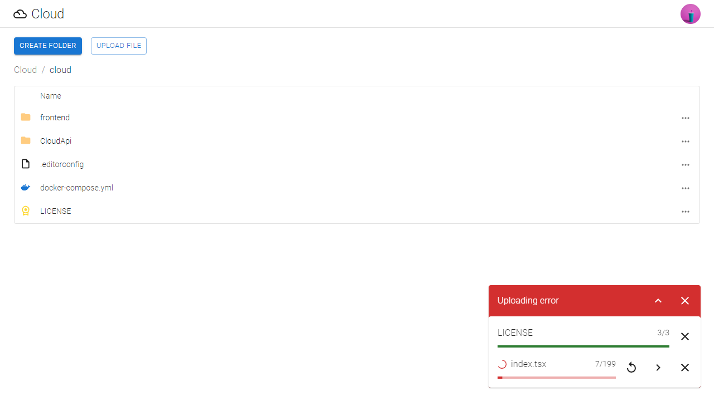
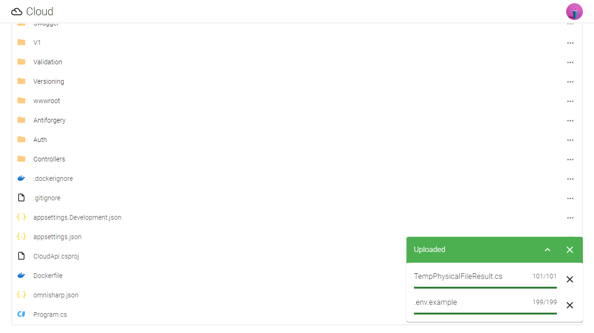
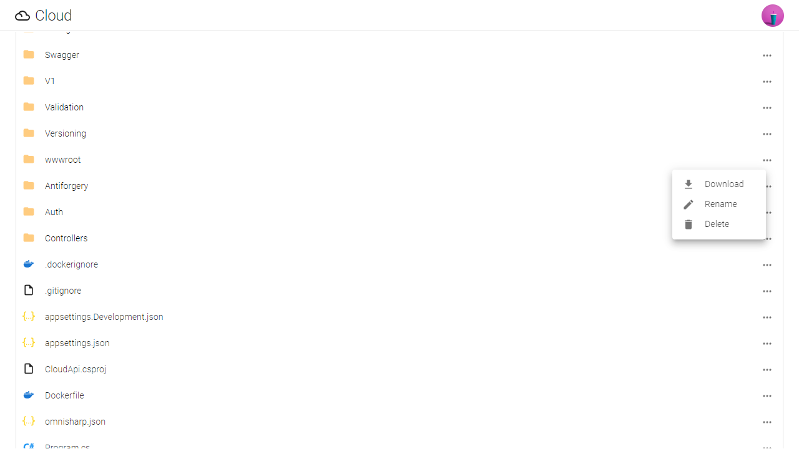

<p align="center">
  
</p>

<h1 align="center">
  Cloud
</h1>

<p align="center">
  File storage service
</p>

## Table Of Contents

- [Technology Stack](#technology-stack)
  - [Frontend](#frontend)
  - [Backend](#backend)
- [How To Deploy](#how-to-deploy)
- [How To Start](#how-to-start)
- [Screenshots](#screenshots)
- [License](#license)

## Technology Stack

### Frontend

- React (create-react-app)
- TypeScript
- MUI
- Emotion
- React Query
- And many others (see package.json)

### Backend

- ASP.NET Core
- ASP.NET Core Identity
- Entity Framework (SQLite or PostgreSQL)
- Swagger
- ImageMagick

## How To Deploy

Not for production.

Required tools:

- Git
- Docker
- Docker Compose

Download project:

```bash
git clone https://github.com/Trequend/cloud.git
cd cloud
```

Start:

```bash
docker compose up -d
```

## How To Start

Recommended editor: `Visual Studio Code`

Required tools:

- Git
- Node.js
- Yarn
- .NET SDK
- EF Core .NET CLI tools

Download project:

```bash
git clone https://github.com/Trequend/cloud.git
cd cloud
```

Open api:

```bash
cd CloudApi
```

Restore dependencies:

```bash
dotnet restore
```

Apply migrations:

```bash
dotnet ef database update --context DatabaseContext
```

Start api:

```bash
dotnet watch
```

Open frontend:

```bash
cd ../frontend
```

Install dependencies:

```bash
yarn install
```

Start application:

```bash
yarn run start
```

## Screenshots

















## License

MIT

<a target="_blank" href="https://icons8.com/icon/114890/cloud">Cloud</a> icon by <a target="_blank" href="https://icons8.com">Icons8</a>
